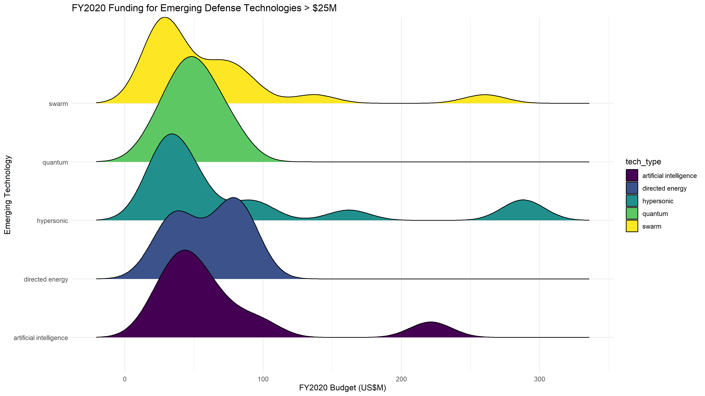
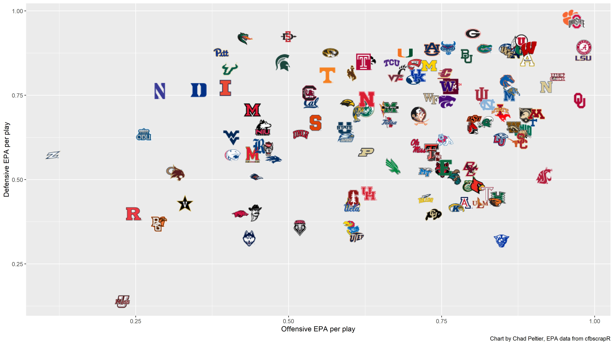
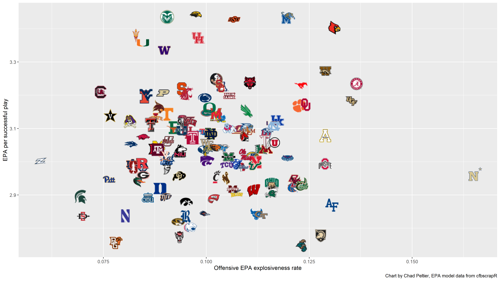
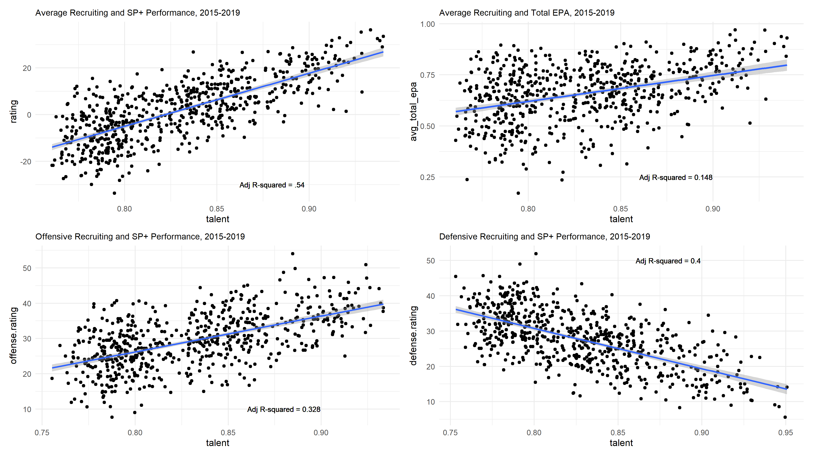

## Portfolio

---
### Defense and OSINT Analysis
[Modeling Naval Ship Classes](https://github.com/cgpeltier/Defense/blob/master/fighting_ships_modeling.md)

[Scraping DoD Contract Award Data](https://github.com/cgpeltier/Defense/blob/master/dod_contract_award_scraping.md)

This project scrapes data from the DoD contract award announcements website, with a function to easily pull structured contract details for any record back to 2014. 

[U.S. DoD R&D Budget Analysis: Scraping Budget Justification Books and Emerging Technology Analysis](https://github.com/cgpeltier/Defense/blob/master/dod_budget_scraping.md)

This project scrapes DoD program descriptions and other data from the R&D Budget Justification Books, and analyzes various emerging technologies in the FY2020 DoD Budget.

[Comparion of U.S. and China R&D Budgets](https://github.com/cgpeltier/Defense/blob/master/rd_investment_project.md)

An exploratory analysis of U.S. and Chinese R&D budgets, comparing overall R&D budget data from the OECD and defense R&D budget data from Jane's.

### Public Policy and Political Analysis
[Exploratory Analysis of the 2018 Georgia Governor Race](https://github.com/cgpeltier/Public-Policy-Politics/blob/master/ga_governor2018.md)

This project uses Census and American Community Survey (ACS) data to analyze the results of the 2018 Georgia governor race.

### College Football Analysis
I learned data science in large part through analysis of college football data. Between the 2013 and 2019 college football seasons I wrote twice-weekly articles for Football Outsiders and various SB Nation sites using advanced football analytics. Below are some of my college football projects:

[How Players Change Positions in College](https://github.com/cgpeltier/CFB_EPA/blob/master/roster_position_project.md)

[EPA Analysis](https://github.com/cgpeltier/CFB_EPA/blob/master/epa_analysis.md)

[Charting Team Explosiveness](https://github.com/cgpeltier/CFB_EPA/blob/master/charting_team_explosiveness.md)

[The Relationship Between Talent and Production in College Football](https://github.com/cgpeltier/CFB_EPA/blob/master/talent_production_project.md)

### Music Analysis
This project analyzes the music of one of my favorite musicians, Sturgill Simpson. 

[stuRgill](https://github.com/cgpeltier/Music/blob/master/stuRgill.md)

---

Page template forked from <a href="https://github.com/evanca/quick-portfolio">evanca</a>

<!-- Remove above link if you don't want to attibute -->
