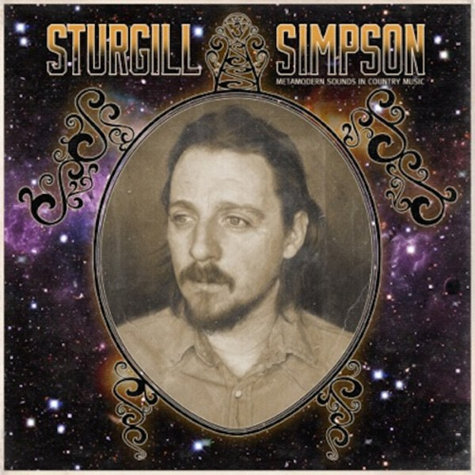

## Portfolio

---

### College Football Analysis
I learned data science in large part through analysis of college football data. Between the 2013 and 2019 college football seasons I wrote twice-weekly articles for [Football Outsiders]("https://www.footballoutsiders.com/") and various [SB Nation]("https://www.sbnation.com/") sites using advanced football analytics. Below are some of my college football projects:

[EPA Analysis](https://github.com/cgpeltier/CFB_EPA/blob/master/epa_analysis.md)

---
[Charting Team Explosiveness](https://github.com/cgpeltier/CFB_EPA/blob/master/charting_team_explosiveness.md)

---
[How Players Change Positions in College](https://github.com/cgpeltier/CFB_EPA/blob/master/roster_position_project.md)

---
[The Relationship Between Talent and Production in College Football](https://github.com/cgpeltier/CFB_EPA/blob/master/talent_production_project.md)

---
### Music Analysis
This project analyzes the music of one of my favorite musicians, Sturgill Simpson. 
[stuRgill](https://github.com/cgpeltier/Music/blob/master/stuRgill.md)

Image from [Pitchfork]("https://pitchfork.com/reviews/albums/19386-sturgill-simpson-metamodern-sounds-in-country-music/")

---

---

Page template forked from <a href="https://github.com/evanca/quick-portfolio">evanca</a>

<!-- Remove above link if you don't want to attibute -->
