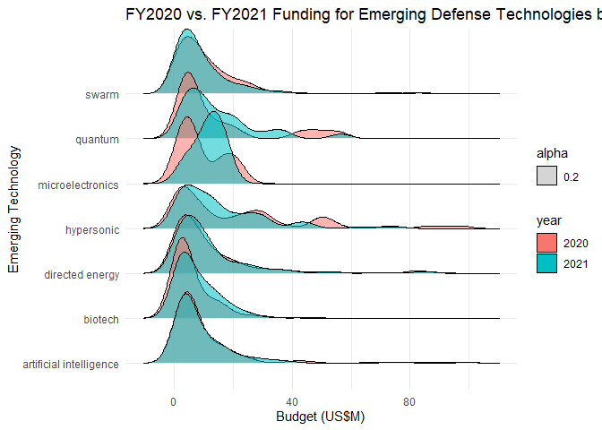
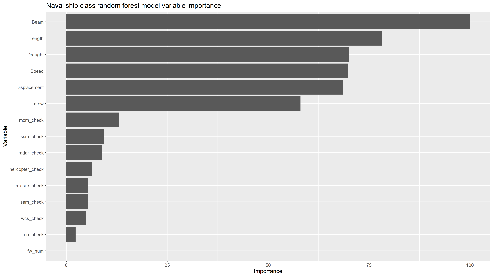
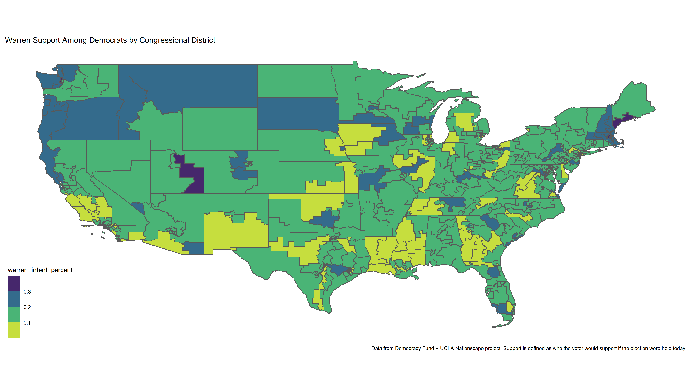

## Portfolio

---
### Defense and OSINT Analysis
[U.S. DoD R&D Budget Analysis: Comparing the FY2020 and FY2021 Budgets' Focus on Emerging Technologies](https://github.com/cgpeltier/Defense/blob/master/dod_budget_scraping_fy2021.md)

This project scrapes DoD program descriptions and other data from the R&D Budget Justification Books, and analyzes various emerging technologies in the FY2020 and FY2021 DoD Budgets. It was turned into an article for War on the Rocks: [Put Your Money Where Your Strategy Is: Using Machine Learning to Analyze the Pentagon Budget](https://warontherocks.com/2020/03/put-your-money-where-your-strategy-is-using-machine-learning-to-analyze-the-pentagon-budget/).

[Estimating Unknown Ship Specifications](https://github.com/cgpeltier/Defense/blob/master/Modeling-Ship-Displacement.md)

This project uses data from *Jane's Fighting Ships* to estimate unknown ship specifications, starting with a ship's displacement. 

[Modeling Naval Ship Classes](https://github.com/cgpeltier/Defense/blob/master/fighting_ships_modeling.md)

This project uses a random forest machine learning classifier to model ship classes (i.e. destroyers, frigates, and amphibious assault ships) based on various specifications and characteristics from *Jane's Fighting Ships* data. 

[Scraping DoD Contract Award Data](https://github.com/cgpeltier/Defense/blob/master/dod_contract_award_scraping.md)

This project scrapes data from the DoD contract award announcements website, with a function to easily pull structured contract details for any record back to 2014. 

[Comparion of U.S. and China R&D Budgets](https://github.com/cgpeltier/Defense/blob/master/rd_investment_project.md)

An exploratory analysis of U.S. and Chinese R&D budgets, comparing overall R&D budget data from the OECD and defense R&D budget data from Jane's.

### Public policy and political analysis
[Analysis of Elizabeth Warren's Presidnetial Campaign](https://github.com/cgpeltier/Public-Policy-Politics/blob/master/nationscape.md)

An analysis of what factors affected Democratic voters' declining support of Elizabeth Warren despite high overall favorability. 

[Exploratory Analysis of the 2018 Georgia Governor Race](https://github.com/cgpeltier/Public-Policy-Politics/blob/master/ga_governor2018.md)

This project uses Census and American Community Survey (ACS) data to analyze the results of the 2018 Georgia governor race.

### Other projects
[How Players Change Positions in College](https://github.com/cgpeltier/CFB_EPA/blob/master/roster_position_project.md)

[stuRgill](https://github.com/cgpeltier/Music/blob/master/stuRgill.md)

This project analyzes the music of one of my favorite musicians, Sturgill Simpson. 

---

Page template forked from <a href="https://github.com/evanca/quick-portfolio">evanca</a>

<!-- Remove above link if you don't want to attibute -->
